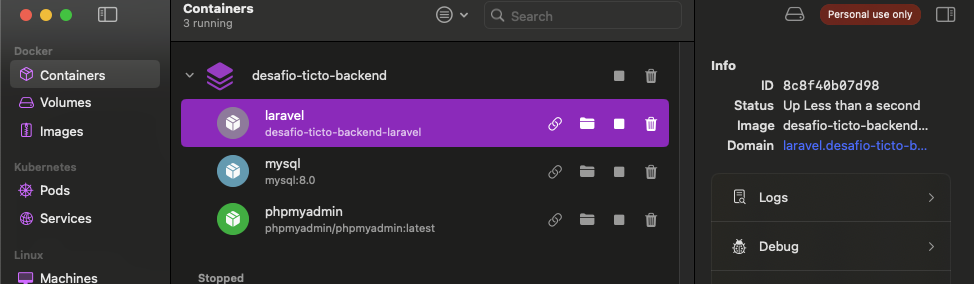
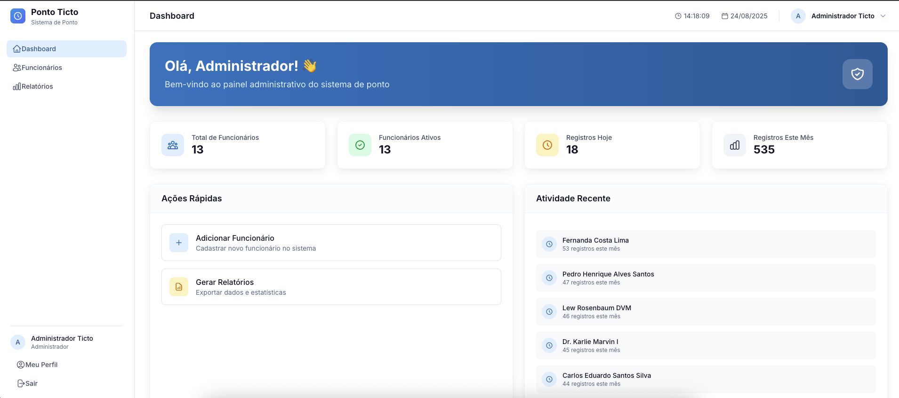
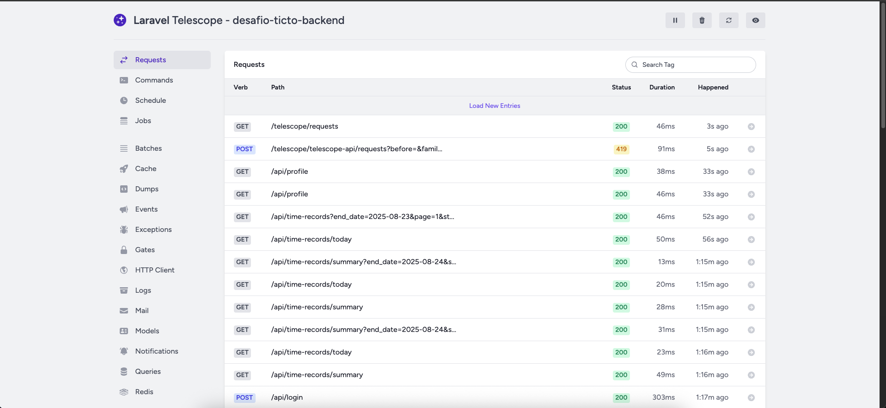
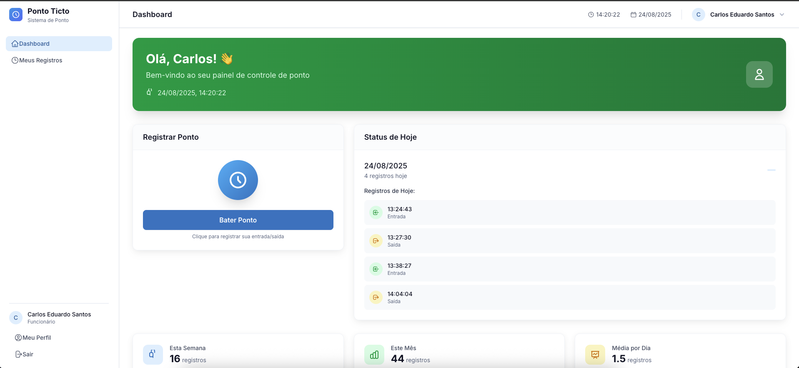
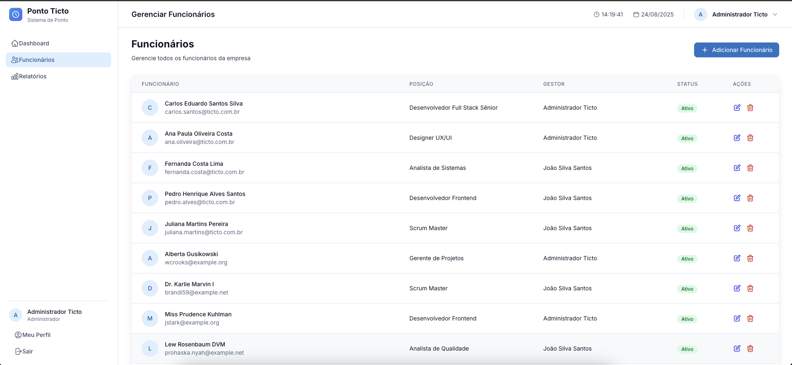
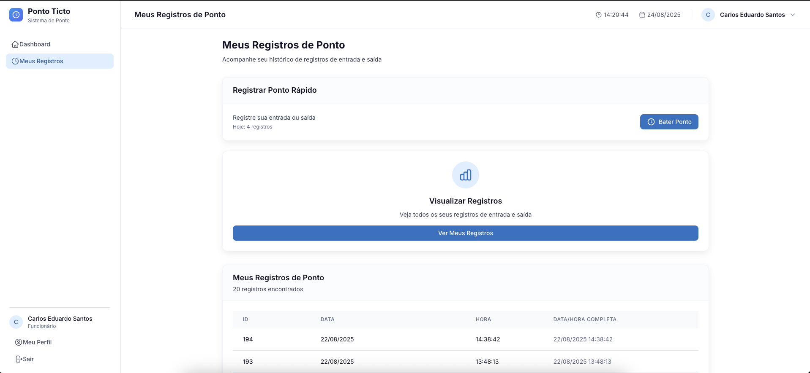
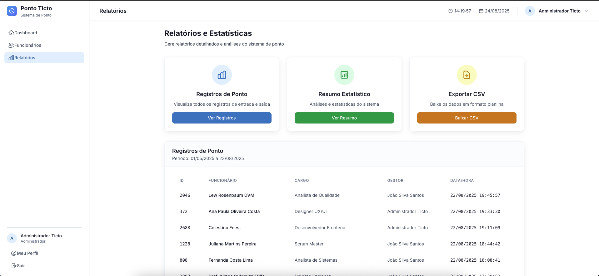
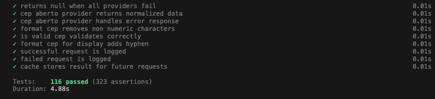
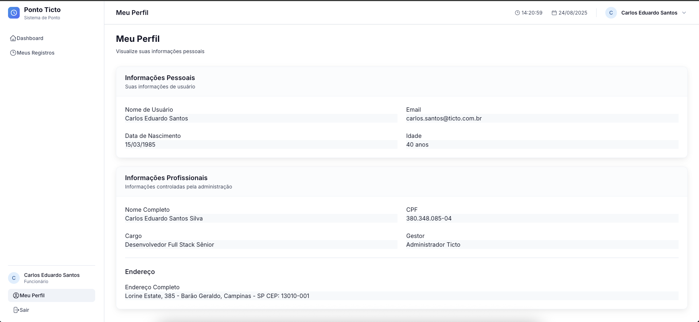

# Desafio Ticto - Backend

Sistema de controle de ponto eletrônico com gestão de funcionários, desenvolvido em Laravel com arquitetura moderna e interface responsiva.

## Arquitetura do Backend

### Tecnologias Utilizadas

-   **Laravel 11** - Framework PHP robusto e moderno
-   **MySQL 8.0** - Banco de dados relacional
-   **Laravel Sanctum** - Autenticação API com tokens
-   **Alpine.js** - Reatividade frontend sem complexidade
-   **Tailwind CSS** - Framework CSS utilitário
-   **Docker** - Containerização e ambiente de desenvolvimento

### Estrutura da API

-   **RESTful API** com 20 endpoints organizados
-   **Middleware de autenticação** para admin e funcionários
-   **Validação robusta** com Form Requests customizados
-   **Relacionamentos Eloquent** otimizados
-   **Paginação automática** com scroll infinito



## Frontend e Arquitetura

### Interface Responsiva

-   **Design System** consistente com Tailwind CSS
-   **Componentes reutilizáveis** em Blade templates
-   **Alpine.js** para interatividade sem SPA
-   **Layouts adaptativos** para diferentes dispositivos

### Funcionalidades Principais

-   **Dashboard administrativo** com métricas em tempo real
-   **Gestão de funcionários** com CRUD completo
-   **Sistema de ponto eletrônico** intuitivo
-   **Relatórios avançados** com filtros dinâmicos
-   **Perfil de usuário** adaptativo por tipo



## Documentação da API

### Collection Postman

-   **20 endpoints** documentados e testados
-   **Autenticação automática** com tokens
-   **Scripts de teste** para validação
-   **Exemplos de uso** para cada endpoint

### Endpoints Principais

-   **Authentication** (6): Login, logout, perfil, alteração de senha
-   **Employees** (5): CRUD completo de funcionários
-   **Time Records** (6): Sistema de ponto e relatórios
-   **Reports** (3): Relatórios administrativos

### Como Usar a Documentação

A documentação completa da API está disponível via **Postman**:

1. **Importe a Collection**: `postman_collection_updated.json`
2. **Configure o Environment**: Use as variáveis de ambiente fornecidas
3. **Execute o Login**: Para obter tokens de autenticação automaticamente
4. **Teste os Endpoints**: Todos os 20 endpoints estão documentados e testados

**Arquivos necessários:**

-   Collection: `postman_collection_updated.json`
-   Environment: `postman_environment.json`

A collection inclui scripts automáticos para gerenciar tokens e validação de respostas.

## Observabilidade

### Laravel Telescope

-   **Debugging avançado** em desenvolvimento
-   **Monitoramento de queries** SQL
-   **Logs de requisições** e respostas
-   **Inspeção de cache** e sessões
-   **Rastreamento de jobs** e eventos



## Docker e Ambiente

### Configuração Docker

```bash
# Clonar o repositório
git clone <repository-url>
cd desafio-ticto-backend

# Iniciar containers
docker-compose up -d

# Acessar container Laravel
docker-compose exec laravel bash
```

### Docker Compose

-   **MySQL 8.0** - Banco de dados principal com **InnoDB obrigatório**
-   **Laravel** - Aplicação PHP com Nginx
-   **Volumes persistentes** para dados
-   **Networks isoladas** para segurança
-   **Configurações otimizadas** para InnoDB e português brasileiro


## Populando o Banco de Dados

### Comandos no Container Laravel

```bash
# Acessar container
docker-compose exec laravel bash

# Instalar dependências
composer install

# Configurar ambiente
cp .env.example .env
php artisan key:generate

# Executar migrações
php artisan migrate

# Popular banco com dados de teste
php artisan db:seed

# Criar usuários específicos
php artisan db:seed --class=AdminSeeder
php artisan db:seed --class=TimeTrackingSeeder
```

### Build do Frontend

````bash
# Acessar container
docker-compose exec laravel bash

# Instalar dependências Node.js
npm install

# Build para desenvolvimento
npm run dev

# Build para produção
npm run build


### Seeders Disponíveis

-   **AdminSeeder** - Usuário administrador padrão
-   **TimeTrackingSeeder** - Dados de funcionários e registros
-   **DatabaseSeeder** - Ordem de execução dos seeders

## Como Executar

### Pré-requisitos

-   Docker e Docker Compose instalados
-   Git para clonar o repositório
-   Porta 8000 disponível para a aplicação

### Passos de Instalação

1. **Clone o repositório**
2. **Inicie os containers** com `docker-compose up -d`
3. **Configure o banco** executando os comandos de seed
4. **Acesse a aplicação** em `http://localhost:8000`

## Login e Uso

### Credenciais de Acesso

-   **Administrador**
    -   Email: `admin@ticto.com.br`
    -   Senha: `admin123`
-   **Funcionário**
    -   Email: `carlos.santos@ticto.com.br`
    -   Senha: `carlos123`

### Funcionalidades por Tipo de Usuário

#### Administrador

-   **Dashboard completo** com métricas
-   **Gestão de funcionários** (CRUD)
-   **Visualização de registros** de todos os funcionários
-   **Relatórios avançados** com exportação
-   **Acesso ao perfil** pessoal


#### Funcionário

-   **Dashboard simplificado** com informações pessoais
-   **Registro de ponto** eletrônico
-   **Histórico de registros** pessoal
-   **Perfil completo** com dados pessoais
-   **Resumo de horas** trabalhadas



## Funcionalidades Principais

### Gestão de Funcionários

-   Cadastro completo com validação de CPF
-   Integração com API de CEP para endereços
-   Sistema de gestão hierárquica
-   Controle de status ativo/inativo



### Sistema de Ponto

-   Registro de entrada e saída
-   Histórico detalhado por período
-   Resumo de horas trabalhadas
-   Status do dia atual



### Relatórios Administrativos

-   Relatórios de ponto por funcionário
-   Resumo geral da empresa
-   Exportação de dados
-   Filtros por período e gestor



## Testes

### Executando Testes

```bash
# Acessar container
docker-compose exec laravel bash

# Executar todos os testes
php artisan test

# Executar testes específicos
php artisan test --filter=EmployeeTest
php artisan test --filter=AuthTest
````

### Cobertura de Testes

-   **Testes unitários** para modelos e serviços
-   **Testes de feature** para endpoints da API
-   **Testes de middleware** para autenticação
-   **Validação de regras** de negócio



## Perfil de Usuário

### Funcionalidades do Perfil

-   **Dados pessoais** atualizáveis
-   **Informações profissionais** específicas por tipo
-   **Endereço completo** com validação de CEP
-   **Histórico de atividades** recentes



## Desenvolvimento

### Estrutura do Projeto

```
desafio-ticto-backend/
├── app/
│   ├── Http/Controllers/     # Controllers da API e Web
│   ├── Models/               # Modelos Eloquent
│   ├── Services/             # Serviços de negócio
│   └── Http/Requests/        # Validação de dados
├── database/
│   ├── migrations/           # Estrutura do banco
│   ├── seeders/              # Dados de teste
│   └── factories/            # Fábricas para testes
├── resources/views/          # Templates Blade
├── routes/                   # Definição de rotas
└── tests/                    # Suite de testes
```

### Comandos Úteis

```bash
# Limpar cache
php artisan cache:clear
php artisan config:clear
php artisan route:clear

# Gerar documentação da API
php artisan l5-swagger:generate

# Monitorar logs em tempo real
tail -f storage/logs/laravel.log
```

## Sugestões de Funcionalidades Futuras

-   **Sistema de recuperação de senha** via email com tokens seguros
-   **Autenticação de dois fatores (2FA)** para administradores
-   **Histórico de login** com detecção de atividades suspeitas

-   **Dashboard executivo** com KPIs de produtividade
-   **Gráficos interativos** de horas trabalhadas por período
-   **Comparativos** entre equipes e departamentos
-   **Tendências sazonais** de produtividade
-   **Relatórios de absenteísmo** e atrasos

-   **Banco de horas** para controle de saldo positivo/negativo
-   **Projetos e tarefas** com alocação de horas
-   **Metas mensais** de horas por colaborador
-   **Acompanhamento de horas executadas vs. planejadas**
-   **Sistema de aprovação** de horas extras
-   **Integração com ferramentas** de gestão de projetos

-   **Gestão de férias** e folgas
-   **Controle de benefícios** e adicionais
-   **Avaliações de desempenho** baseadas em pontualidade
-   **Notificações automáticas** para gestores sobre atrasos
-   **Relatórios de compliance** para auditoria

-   **Webhooks** para integração com sistemas externos
-   **Exportação automática** para sistemas de folha de pagamento
-   **Integração com calendários** corporativos
-   **Sincronização com sistemas** de gestão de pessoas

-   **Relatórios personalizáveis** por gestor
-   **Exportação em múltiplos formatos** (PDF, Excel, CSV)
-   **Assinatura digital** de relatórios
-   **Auditoria completa** de alterações

-   **Detecção automática** de padrões de trabalho
-   **Previsão de demanda** de horas por projeto
-   **Otimização de escalas** baseada em histórico
-   **Machine Learning** para identificação de anomalias

## Licença

Este projeto foi desenvolvido como parte do desafio técnico da Ticto. Todos os direitos reservados.

---

**Desenvolvido com Laravel e tecnologias modernas**
